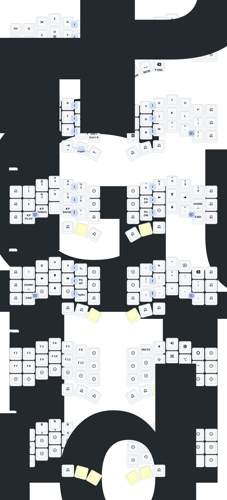

Corne v4 firmware forked from [https://github.com/yangxing844/zmk-config](https://github.com/yangxing844/zmk-config).

Timing of homerow mods are updated base on https://github.com/urob/zmk-config

This branch is doesn't include nice view for lpm features from upstream. It is because the nice view widgets shows up side down in corne v4 lpm screen.
